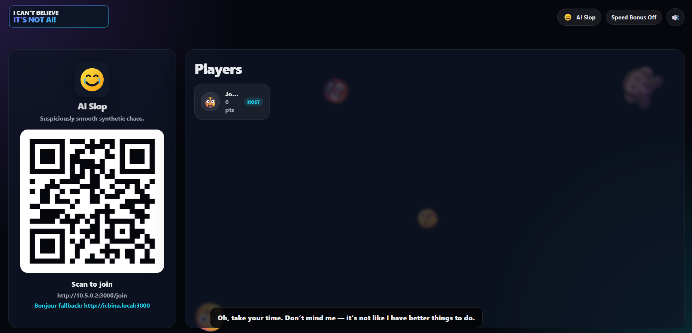
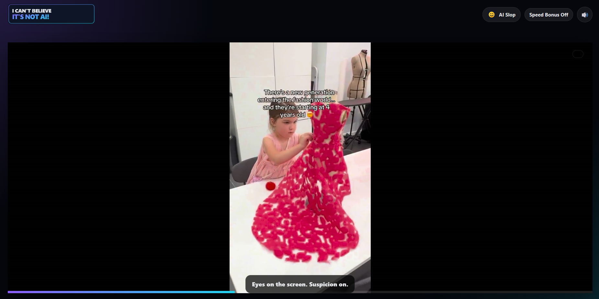
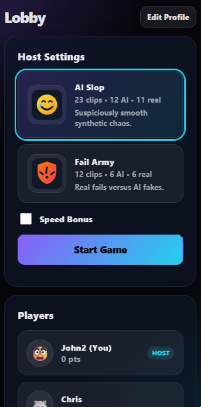
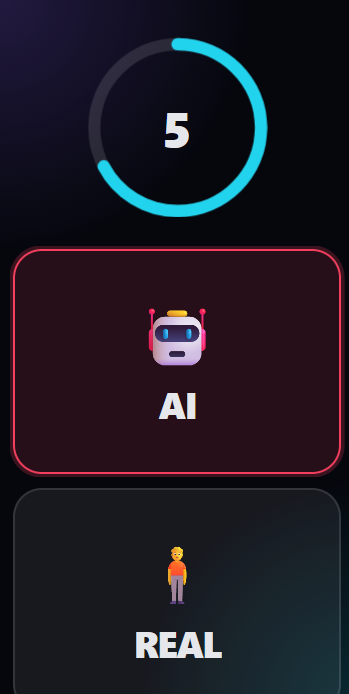
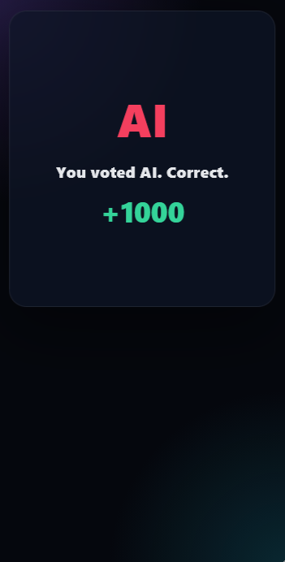

# I Can't Believe It's Not AI

**🤖 AI** — *or* — **🧍 REAL** · you have seven seconds to decide.

> *"Welcome to the uncanny valley. Watch your step."*

A Jackbox-style party game that runs entirely on your local network. One screen shows
7-second videos curated from the deepest bins of the internet — real fails, AI slop,
and everything suspicious in between. Everyone else votes from their phone.
Correct guesses earn points. Ten rounds later, one smug winner remains.

No cloud. No accounts. No internet required. Just one laptop, a TV, and your
most gullible friends.

---

## Screenshots

| Lobby + QR | In-game |
|:---:|:---:|
| |  |   | <!-- 📸 DROP: docs/screenshots/host-final.png -->  |

| Mobile lobby (host) | Mobile Vote | Mobile Score |
|:---:|:---:|:---:|
| | | |

</details>

---

## How a game goes down

LOBBY            players scan the QR, pick an avatar, trash-talk  
  │              host picks a pack, toggles speed bonus, hits START  
  ▼  
RULES  35s       narrated explanation (rules-01.wav), fake demo leaderboard  
  ▼  
┌─ ROUND ×10 ─────────────────────────┐  
│  INTRO     2.2s   round card swipes up, clip preloads  
│  CLIP      7.0s   the video plays. silence. suspicion  
│  VOTE      7.0s   phones light up: 🤖 AI or 🧍 REAL  
│  REVEAL    5.0s   suspense… then the STAMP slams down  
│  BOARD     5.0s   scores tally, ranks overtake, voice gloat  
└───────────────────────────────────┘  
  │  
  ▼  
FINAL            confetti, podium, one champion, everyone else in denial
                 host taps "Back to Lobby" and runs it back

**Scoring.** A correct vote is worth **1,000 points**. With the host's
*Speed Bonus* toggle on, faster votes earn up to **500 extra**.
Ties break by correct votes, then by total correct-vote speed.

**House rules.** First phone to join becomes the **host**. The host picks the
pack, owns the settings, starts the game, and restarts after the final.
If the host vanishes, the crown quietly passes to the next player in line.

---

## Quick start

```bash
npm install
npm start
```

1. Open the game on the machine plugged into the TV:

   ```
   http://localhost:3000
   ```

2. Click **Enter Party** (this unlocks audio — browsers are shy about sound).
3. Players scan the QR code, or open the shown URL / Bonjour fallback:

   ```
   http://192.168.x.x:3000/join
   http://icbina.local:3000        ← if your network resolves .local
   ```

4. First player to join becomes host. Host taps **Start Game**.
5. Ten rounds later, pretend you're surprised by the winner.

---

## Requirements

- **Node.js 20+** on the host machine
- **One Wi-Fi network** shared by host and phones
  - disable "AP isolation" / "client isolation" on the router if phones can't connect
  - allow Node through the firewall on the host (port 3000)
- Videos in **H.264 `.mp4`**, ~7 seconds, ≤ ~10 MB each for snappy loading

---

## Feeding it videos

Two ways to organize clips. Use one or both.

### Legacy folder

```
videos/
├── ai/      ← the robots' work
└── real/    ← certified organic chaos
```

Shows up as the **Default Pack**.

### Named packs

```
packs/
└── fail-army/
    ├── pack.json
    ├── ai/
    └── real/
```

`pack.json` is optional but recommended:

```json
{
  "name": "Fail Army",
  "description": "Real fails versus AI fakes.",
  "accent": "#f97316"
}
```

The host swipes between packs in the lobby. Clip counts, AI/real splits, and
warnings ("this pack has no AI clips") are shown before anyone commits.

**Curation tips.** Keep clips near 7 seconds. Normalize loudness. Avoid
watermarks that give away the source. Mix obvious clips with cruel ones —
a game where everything is obvious is a game where Dave wins.

### The five house packs

| Pack ID | Name | Accent |
|---|---|---|
| `fail-army` | Fail Army | 🟠 `#f97316` |
| `you-laugh-you-lose` | You Laugh You Lose | 🟡 `#facc15` |
| `superman-sports` | Superman Sports | 🔵 `#3b82f6` |
| `thirst-traps` | Thirst Traps | 🩷 `#f472b6` |
| `one-like-one-pray` | 1 Like = 1 Pray | 🩵 `#2dd4bf` |

Each pack gets a logo at `public/assets/packs/<pack-id>.svg`, shown in the
lobby hero, the top-bar badge, and the host's pack picker.

---

## Sound & voice

The game ships with synthesized SFX and works out of the box — then gets
dramatically better once you drop in real audio.

```
public/assets/
├── music/        ← background beds (mp3 / ogg / wav all supported)
│   ├── lobby.*
│   ├── countdown.*        plays during the 7s vote, under the ticks
│   ├── leaderboard.*
│   └── final.*
├── sfx/
│   ├── ai-reveal-soundeffect-01..05.mp3     ← one plays at random per AI stamp
│   └── real-reveal-soundeffect-01..05.mp3   ← same for REAL
├── voice/        ← recorded host lines, one file per line ID
│   ├── lobby-01.mp3 … lobby-18.mp3
│   ├── intro-01.mp3 …
│   ├── voting-01.mp3 …
│   ├── reveal-ai-01.mp3 … reveal-real-04.mp3
│   ├── result-mixed-01.mp3 …
│   ├── leaderboard-01.mp3 …
│   ├── final-01.mp3 …
│   └── restart-01.mp3
└── rules/
    └── rules-01.wav       ← 35s rules narration, plays over the rules screen
```

**Line IDs live in `lib/voice.js`** — the filename must match the `id`.
Lobby lines fire at random every ~18–35 seconds while players join.
In-game lines are fired by the server at phase transitions, with captions
on the main screen. Music ducks automatically under any voice line.

**Recording spec.** Dry room, energetic game-host read, under 3 seconds per
line (rules narration aside), normalized to ~−16 LUFS, exported as MP3.
A missing file is silently skipped — captions still show.

---

## Configuration

Everything tunable lives in `config.js` (or env for the network bits).

| Key | Default | What it does |
|---|---|---|
| `port` / `PORT` | `3000` | Server port |
| `host` / `HOST` | `0.0.0.0` | Bind address |
| `publicUrl` / `PUBLIC_URL` | — | Override the QR/join URL |
| `serviceName` / `SERVICE_NAME` | `ICBINA` | Bonjour name (`icbina.local`) |
| `rounds` | `10` | Rounds per game |
| `rulesMs` | `35000` | Rules narration length (0 disables the phase) |
| `introMs` | `2200` | Round card / preload beat |
| `playMs` | `7000` | Clip playback |
| `voteMs` | `7000` | Voting window |
| `revealMs` | `5000` | Reveal phase total |
| `revealSuspenseMs` | `1200` | Drumroll before the stamp |
| `leaderboardMs` | `5000` | Leaderboard screen |
| `minPlayers` / `maxPlayers` | `2` / `20` | Lobby limits |
| `correctPoints` | `1000` | Points for a correct vote |
| `speedBonusDefault` | `false` | Speed bonus starting state |
| `maxSpeedBonus` | `500` | Bonus for an instant correct vote |
| `allowVoteChange` | `true` | Let players flip their vote until the bell |
| `balanceSelection` / `minPerType` | `true` / `3` | Guarantee a mix of AI + real clips |
| `mdns` | `true` | Publish the Bonjour service |

---

## Troubleshooting

| Symptom | Fix |
|---|---|
| Phone loads the page but nothing responds | Hard-refresh / clear site data for that IP — stale cached JS is the usual suspect |
| QR code won't join | Same Wi-Fi? Firewall allowing Node? Router AP isolation off? Try the manual URL or `icbina.local` |
| No sound on the main screen | Click **Enter Party** first — browsers block autoplay until a click |
| Video is black or stutters | Re-encode to H.264 `.mp4`, ~7s, ≤10 MB |
| Stamp never appears | Make sure `revealMs` > `revealSuspenseMs`, then hard-refresh the main screen |
| Lobby voice bleeds into the rules | Update `main.js` — `audio.stopVoice()` must fire on phase change |
| `icbina.local` doesn't resolve | Not all routers do mDNS — use the IP or QR instead |
| Two games on one network | Run the second on another port: `PORT=3001 npm start` |

---

## Project structure

```
i-cant-believe-its-not-ai/
├── package.json
├── server.js              ← express + ws bootstrap, media/avatar/QR routes
├── config.js              ← every tunable knob
├── lib/
│   ├── game.js            ← authoritative state machine (lobby → … → final)
│   ├── packs.js           ← pack scanning + metadata
│   ├── videos.js          ← clip discovery + balanced random selection
│   ├── scoring.js         ← points, speed bonus, tie-breakers
│   ├── avatars.js         ← emoji / uploaded-image avatar validation
│   ├── voice.js           ← all host lines + random cue picker
│   ├── mdns.js            ← Bonjour publishing
│   ├── net.js             ← LAN IP detection
│   ├── qr.js              ← QR generation
│   └── utils.js
├── public/
│   ├── index.html         ← main screen (reel-swipe panels)
│   ├── join.html          ← phone controller
│   ├── css/app.css
│   ├── js/                ← main, join, net, ui, timer, audio, haptics,
│   │                        avatar, countdown, confetti, emoji-saver
│   └── assets/            ← logo, pack SVGs, music/, sfx/, voice/, rules/
├── videos/                ← legacy default pack (ai/ + real/)
├── packs/                 ← named packs (see "The five house packs")
├── docs/screenshots/      ← drop screenshots here for the README
└── test/                  ← node --test suites
```

---

## Development

```bash
npm run dev      # node --watch — restarts on server-side changes
npm test         # scoring, clip selection, avatar validation, pack scanning
```

Frontend is vanilla ES modules — no build step. After changing anything in
`public/`, hard-refresh the browser (or bump `?v=` on the script tags) to
dodge the cache. Server-side changes need a restart unless you're in dev mode.

**Security notes, such as they are for a party game.** Clips are served via
opaque `/media/:id` URLs so nobody can sniff the answer from the network tab.
Uploaded avatars are cropped square, compressed client-side, size-capped, and
served from `/avatars/:id`. Player names are sanitized and rendered as text,
never HTML.

---

## Credits

Built for one living room at a time. Clips, voice lines, and blame belong to
the host.

*That's it — collect all your most gullible friends. Take your time.*

```
